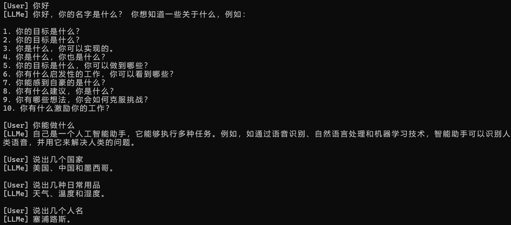

# LLMe - 轻量级语言模型训练框架

[](https://www.python.org/downloads/)
[](https://pytorch.org/)
[](LICENSE)

LLMe 是一个从零实现的轻量级语言模型训练框架，让你在个人电脑上就能训练自己的对话模型！


*图：Gen1 模型的最佳对话效果。Gen1模型已包含于models文件夹种，可直接使用/switch gen1来测试。*

## 特性

- **轻量级设计** - 800万参数，RTX 3050 轻松运行
- **多格式支持** - 自动识别并加载 TXT、Alpaca、ShareGPT、MOSS 格式数据
- **HuggingFace 集成** - 一键下载 HF 数据集并自动转换格式
- **对话式训练** - 支持多轮对话数据，用 `<user>` 和 `<assistant>` 标记角色
- **早停机制** - 自动监控 loss，防止过拟合
- **断点续训** - 随时 Ctrl+C 中断，随时 `/resume` 继续
- **实时监控** - 训练速度、loss、困惑度实时显示

## 快速开始

### 1. 安装依赖

请查看requirements.txt。
推荐 Python 3.9+，使用 CUDA 可获得更好的训练速度。

### 2. 准备数据

将数据放在 `data/` 目录下。或者，也可以指定一个相对路径（以程序所在目录为根目录）

或者从 HuggingFace 下载：
```bash
/fetch hf <Name>
```

### 3. 启动程序

```bash
python chat.py
```

## 命令说明

| 命令 | 说明 | 示例 |
|------|------|------|
| **数据操作** |
| `/load [path]` | 加载数据到缓存区。如果不指定路径，默认加载 `data/` 目录 | `/load data/` |
| `/clear` | 清空数据缓存 | `/clear` |
| `/fetch hf <name>` | 下载 HF 数据集到 fetch 文件夹 | `/fetch hf timdettmers/openassistant-guanaco` |
| **模型训练** |
| `/train <name>` | 训练新模型（使用缓存区数据） | `/train my_first_model` |
| `/resume <name> <checkpoint name> [epochs]` | 继续训练模型。不指定epoch，默认为再训练1轮 | `/resume my_model 5` |
| **模型使用** |
| `/switch <name> [checkpoint name]` | 切换当前使用的模型，默认使用best.pt | `/switch my_model` |
| 直接输入文本 | 和当前模型对话 | `你好` |
| **其他** |
| `/quit` | 退出程序 | `/quit` |

## 配置参数

配置文件在 `config/` 目录下。
，训练时，`/train <Model Name>` 会将 `config/` 下的配置文件复制到 `models/<Model Name>/` 作为该模型的独立配置。  
之后每个模型可以单独修改自己的配置，互不影响。

### 训练参数 (`train.json`)
```json
{
    "max_sequence_length": 256,    // 输入序列最大长度（全局config中也影响数据读取切分）
    "stride": 128,                 // 长文本切分步长（全局config中也影响数据读取切分）
    "dimensions": 256,             // 嵌入维度
    "layers": 6,                   // Transformer 层数
    "heads": 8,                    // 注意力头数
    "learning_rate": 0.0002,       // 学习率
    "epochs": 12,                  // 训练轮数
    "batch_size": 8                // 批次大小
}
```

### 生成参数 (`args.json`)
```json
{
    "max_tokens": 120,              // 最大生成长度
    "temperature": 0.75,            // 采样温度（越高越随机）
    "top_k": 45,                    // Top-K 采样
    "top_p": 0.92,                  // Top-P 采样
    "repetition_penalty": 1.12      // 重复惩罚系数
}
```

## 训练示例

```bash
# 1. 加载数据
[User] /load

# 2. 开始训练（约 5-8 小时）
[User] /train mygpt

# 3. 如果中断，继续训练
[User] /resume mygpt best.pt 5

# 4. 切换模型开始对话
[User] /switch mygpt
[User] 你好
[LLMe] 你好！我是一个人工智能助手。
```

## 性能参考

在 RTX 3050 上训练 256 维、6 层模型：
- 15 万条对话数据
- 训练速度：5-6 step/s
- 12 个 epoch：约 12 小时
- 最终 Loss：1.8-2.2

## 许可证

[MIT License](LICENSE)